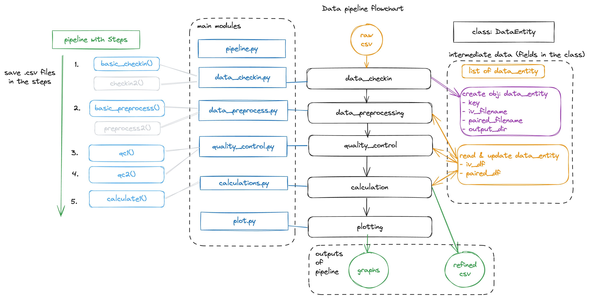

# Pipeline for Data ProcessingPipeline for Data Processing


This package provides a modular and extensible pipeline for processing CSV data files. The pipeline is designed to handle various stages of data processing, including loading, validation, preprocessing, quality control, and calculations. The structure of the package allows for easy addition of new processing steps.

## Directory Structure

```
data/
figs/
functions/
    __init__.py
    calculations.py
    data_checkin.py
    data_entity.py
    data_preprocess.py
    pipeline.py
    plot/
        __init__.py
        plot.py
    quality_control.py
    read_folder.py
main.py
output/
README.md
```

## Key Components

### `DataEntity` Class

The [`DataEntity`](functions/data_entity.py) class is used to store information about each data set, including file paths and data frames. It also provides methods to save processed data.

### `Pipeline` Class

The [`Pipeline`](functions/pipeline.py) class manages the sequence of processing steps. It takes a list of callable steps and applies them sequentially to a `DataEntity` instance.

### Processing Steps

1. **Data Check-in**: The [`basic_checkin`](functions/data_checkin.py) function loads and validates CSV files.
2. **Data Preprocessing**: The [`basic_preprocess`](functions/data_preprocess.py) function modifies the CSV format and cleans up the data.
3. **Quality Control**: The [`qc1`](functions/quality_control.py) and [`qc2`](functions/quality_control.py) functions perform quality control checks on the data.
4. **Calculations**: The [`calculate1`](functions/calculations.py) function performs calculations on the data.

### File Grouping

The [`group_paired_files`](functions/read_folder.py) function groups CSV files by a common key and pairs IV files with Tail/Recovery files.

## Extensibility

The pipeline is designed to be easily extensible. New processing steps can be added by defining new functions and including them in the `steps` list when creating a `Pipeline` instance. Each step function should take a `DataEntity` instance as input and return a modified `DataEntity` instance.

### Example Usage

see `main.py`

```python
from functions.read_folder import group_paired_files
from functions.data_checkin import basic_checkin
from functions.data_preprocess import basic_preprocess
from functions.quality_control import qc1, qc2
from functions.calculations import calculate1
from functions.pipeline import Pipeline
from functions.data_entity import DataEntity

# Define the steps of the pipeline
pipeline = Pipeline(
    steps=[
        basic_checkin,
        basic_preprocess,
        qc1, 
        qc2,
        calculate1
    ]
)

# Group files and run the pipeline
folder_path = "data/"
regex_expression = r"([\d.]+)_(IV|Tail|Recovery)[^\.]*\.csv"
output_dir = "output/"

data_entities = []
for key, iv_file, paired_file in group_paired_files(folder_path, regex_expression):
    data_entity = DataEntity(key, iv_file, paired_file, output_dir)
    processed_data_entity = pipeline.run(data_entity)
    data_entities.append(processed_data_entity)
```

This modular design allows for easy customization and extension of the data processing pipeline to meet specific requirements.